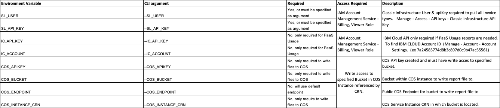

# IBM Cloud Classic Infrastructure Billing API Scripts as a Code Engine Job

Script | Description
------ | -----------
invoiceAnalysis.py | Analyzes all invoices between two dates and creates excel reports.
requirements.txt | Package requirements
logging.json | LOGGER config used by script
Dockerfile | Docker Build file used by code engine to build container.

*invoiceAnalysis.py* analyzes IBM Cloud Classic Infrastructure invoices between two dates and consolidates billing data into an
Excel worksheet for review.  Each tab has a breakdown based on:

   - ***Detail*** tab has every invoice item for analyzed invoices represented as one row each.  All invoice types are included, including CREDIT invoices.  This data is summarized on the following tabs.
   - ***TopSheet-YYYY-MM*** tab(s) have a mapping of each portal invoice, to the IBM monthly CFTS invoice they are billed on.
   - ***InvoiceSummary*** tab is a pivot table of all the charges by product category & month for analyzed invoices. It also breaks out oneTime amounts vs Recurring invoices.
   - ***CategorySummary*** tab is another pivot of all recurring charges broken down by Category, sub category (for example specific VSI sizes)
   - The following Excel tabs will only exist if there are servers of these types on the analyzed invoices
        - ***HrlyVirtualServerPivot*** tab is a pivot of just Hourly Classic VSI's
        - ***MnthlyVirtualServerPivot*** tab is a pivot of just monthly Classic VSI's
        - ***HrlyBareMetalServerPivot*** tab is a pivot of Hourly Bare Metal Servers
        - ***MnthlyBareMetalServerPivot*** tab is a pivot table of monthly Bare Metal Server
   - The following Excel tabs will be created if you supply IC_API_KEY & IC_ACCOUNT
       - ***PaaS_Usage*** shows the complete list of billing items showing the usageMonth, InvoiceMonth, ServiceName, and Plan Name with billable charges for each unit associated with the server. 
       - ***PaaS_Summary*** shows the billing charges for each service consumed.  Note the columns represent the usage month, not billing month. 
       - ***PaaS_Plan_Summary*** show the additional level of detail for the billing charges for each service and plan consumed.  Note the columns represent the usage month, not billing month.

### Setting up IBM Code Engine and building container to run report
1. Create project, build job and job.
    1. Open the Code Engine console
    2. Select Start creating from Start from source code.
    3. Select Job
    4. Enter a name for the job such as invoiceanalysis. Use a name for your job that is unique within the project.
    5. Select a project from the list of available projects of if this is the first one, create a new one. Note that you must have a selected project to deploy an app.
    6. Enter the URL for this GitHub repository and click specify build details. Make adjustments if needed to URL and Branch name. Click Next.
    7. Select Dockerfile for Strategy, Dockerfile for Dockerfile, 10m for Timeout, and Medium for Build resources. Click Next.
    8.  Select a container registry location, such as IBM Registry, Dallas.
    9.  Select Automatic for Registry access.
    10. Select an existing namespace or enter a name for a new one, for example, newnamespace.
    11. Enter a name for your image and optionally a tag.
    12. Click Done.
    13. Click Create.
2. Create configmaps and secrets.
    
    1. From project list, choose newly created project.
    2. Select secrets and configmaps
    3. click create, choose config map, and give it a name. Add the following key value pairs
        - ***COS_BUCKET*** = Bucket within COS instance to write report file to.
        - ***COS_ENDPOINT*** = Public COS Endpoint for bucket to write report file to
        - ***COS_INSTANCE_CRN*** = COS Service Instance CRN in which bucket is located.
    4. Select secrets and configmaps (again)
    6 click create, choose secrets, and give it a name. Add the following key value pairs
         - ***IC_API_KEY*** = an IBM Cloud API Key with Billing access to IBM Cloud Account
         - ***COS_APIKEY*** = your COS Api Key Id with writter access to appropriate bucket
3. Choose the job previously created.
    5. Click on the Environment variables tab.
    6. Click add, choose reference to full configmap, and choose configmap created in previous step and click add.
    7. Click add, choose reference to full secret, and choose secrets created in previous step and click add.
    8. Click add, choose literal value (click add after each, and repeat)
        -  ***startdate*** = start year & month of invoice analysis in YYYY-MM format
        -  ***enddate*** = end year & month invoice analysis in YYYY-MM format
        -  ***output*** = report filename (including extension of XLSX to be written to COS bucket)
4. to Run report click ***Submit job***
5, Logging for job can be found from job screen, by clicking Actions, Logging
 
* Note invoiceAnalysis no longer requires IBM Cloud Classic API keys to execute, and instead uses a single IBM Cloud API Key
(with billing View Access) to access both classic invoices and PaaS Usage for the cloud account.   Currently, you can provide a separate COS ApiKey, 
Service, and bucket information to support the ability to write to a bucket in if a different Cloud Account than the billing data is analyzed against.
